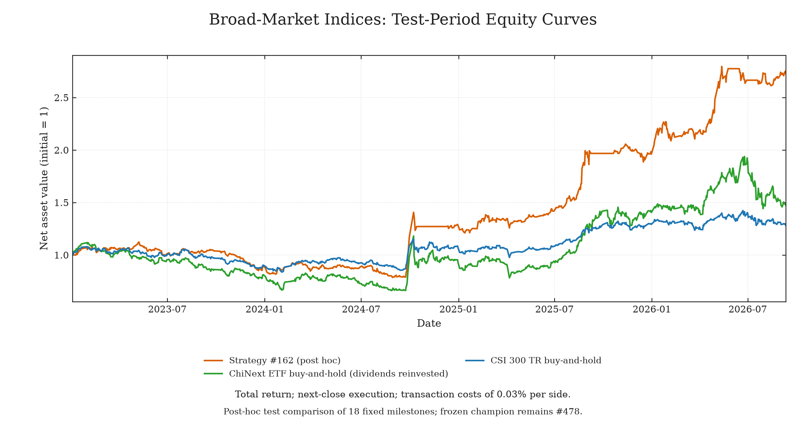
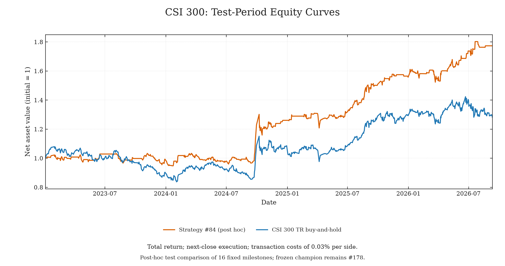

# Quant-AutoResearch

[中文](README.zh-CN.md)

Give an Agent a strategy, a dataset and a research objective, then let it experiment.
It proposes a change, edits the strategy, runs an evaluation, keeps or discards the
result, and repeats. Each attempt leaves a record you can inspect.

You set the direction, reward, constraints, target and budget. The Agent works within
those settings while the data split and evaluator stay fixed. This project adapts the
research loop of [Karpathy's autoresearch](https://github.com/karpathy/autoresearch)
to quantitative strategy research.

## Research examples

The homepage features broad-market index and CSI 300 studies, each with a
20-hour research budget. Test period: 2023–September 11, 2026;
all displayed results use dividends reinvested, next-close execution,
0.03% costs per side and calendar-day CAGR. These are fixed-strategy reevaluations.

### Broad-market indices · Latest study

The Agent researches asset selection and portfolio allocation across a pool of
24 indices and ETF proxies: 488 attempts and 18 historical validation champions
within a 20-hour budget. The chart compares post-hoc selection #162 with ChiNext
and CSI 300 buy-and-hold, all starting from a net asset value of 1.



| Test-period approach | Cumulative return | CAGR | Maximum drawdown |
|---|---:|---:|---:|
| Broad-market strategy #162 (post hoc) | **+172.52%** | **31.24%** | **30.05%** |
| ChiNext ETF buy-and-hold | +47.32% | 11.08% | 40.88% |
| CSI 300 TR buy-and-hold | +28.13% | 6.95% | 22.41% |

Benchmarks use a backward-adjusted ChiNext ETF and the CSI 300 total-return index,
with a 0.03% purchase fee, no rebalancing and no terminal sale.
#162 was selected post hoc among 18 milestones; it did not replace the frozen strategy.

[Broad-market study notes and chart data](examples/studies/broad_market/README.md)

### CSI 300



Strategy #84: **+77.30%** cumulative return vs **+28.13%** buy-and-hold;
maximum drawdown **10.96%** vs **22.41%**. Both studies use the same CSI 300 TR benchmark.
This curve likewise shows the historical validation champion with the highest
test return, selected post hoc.

### Frozen research champions

The strategies selected on validation and frozen before final testing,
reevaluated under the common accounting convention without retuning:

| Study | Attempts | Frozen strategy | Test CAGR | Test max drawdown |
|---|---:|---|---:|---:|
| Broad-market indices | 488 | #478 | 23.33% | 31.00% |
| CSI 300 | 178 | #178 | 12.93% | 11.59% |

Note that continued improvements on the validation set may
not consistently translate into better test performance, so monitor for overfitting.

[All studies (including S&P 500), strategy explanations and replay commands](examples/studies/README.md)

## How it works

`prepare.py` creates a study with fixed chronological training, validation and final-test
partitions. The Agent evaluates candidates through `run.py`, which records each attempt
and restores the current best strategy after a discarded or failed change. Validation
drives selection; the researcher evaluates the final test once after freezing a strategy.

## Quick start

Requirements: Python 3.10+, macOS or Linux. The framework uses only the standard library.

The repository includes CSI300 and S&P 500 daily price-index histories from January
2010 through September 11, 2026. Both use the same data format.

Set the objective, dates and budget in `config/`, then run from the repository:

```sh
python3 prepare.py --example csi300 --workspace ../csi300-study
cd ../csi300-study
python3 run.py --description baseline
```

For S&P 500, replace `csi300` with `sp500` in the commands above.

Preparation creates the study and a sibling final-test directory (`../csi300-study-holdout`).
Full histories stay in the original repository. Use new directories for each study.

## Running the Agent

Open your Agent in the prepared **study directory** and give it a prompt like:

> Read AGENTS.md and program.md. Research strategies within the configured direction
> and budget. Edit only strategy/strategy.py and evaluate each idea through run.py.
> Keep feasible improvements. Freeze the best feasible strategy when the target or
> budget is reached.

Use an Agent connected to your preferred model provider. It runs the experiment loop
and may search external sources for ideas when authorized. `run.py` evaluates one attempt.

Restrict the Agent's access to full histories and final-test data; directory separation
and hashes are not a sandbox. See the [research guide](docs/RESEARCH.md) for deployment
boundaries and the researcher's final evaluation.

## Project structure

```text
prepare.py              Create a study from bundled or custom data
run.py                  Evaluate one candidate or freeze the chosen strategy
program.md / AGENTS.md  Agent instructions and edit boundaries
strategy/               Agent edits strategy.py only
config/                 Researcher sets the objective, budget and time protocol
core/                   Fixed preparation, evaluation, budget and indicators
data/                   CSI300 and S&P 500 histories with source manifests
examples/studies/       Completed studies, charts and archived strategy replays
docs/                   Data contract, indicator conventions and research guide
```

Each study generates `cache/` for prepared data and `runs/` for experiment records.

## Design choices

- **Researcher-defined objectives.** Reward, constraints, target and budget are separate settings.
  Defaults are examples; choose your own objective and an attempt or time budget.
- **Fixed evaluation.** Preparation seals the data split, policy and evaluator;
  labels crossing partition boundaries are excluded.
- **A small execution model.** Long-only, unlevered, with cash and proportional costs.
  Decisions after close execute at the next open and hold until the following open.

## Using other data

**Convert other index or stock data to the same format.** The minimum fields are
`date`, `open`, `close`, and either `index_id` or `symbol`.

```sh
python3 prepare.py --csv /path/to/your-prices.csv --workspace ../custom-study
```

Validate dates against the source market's calendar and use separate studies for different
markets. The current adapter uses open/close and exposes close history to the Agent.

[Data contract](docs/DATA.md) · [Examples](examples/README.md) · [Indicators](docs/INDICATORS.md)

## License

Code and documentation: [MIT](LICENSE).

Market data have separate source terms. Data redistribution
rights have not been cleared; see [data sources and terms](data/README.md).
