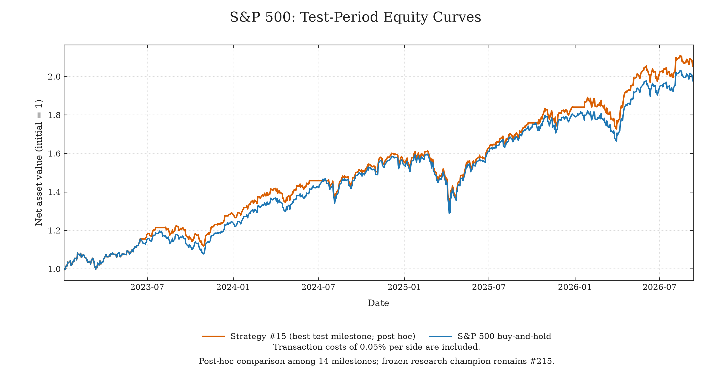

# Quant-AutoResearch

[English](README.md)

给 Agent 一个策略、一份数据和一个研究目标，让它开始实验：提出想法、修改策略、运行评估、
保留或丢弃，再继续下一轮。每次尝试都会留下可以检查的记录。

你设定方向、reward、constraints、target 和 budget，Agent 在这些设置下研究策略，
数据划分与评估器在实验期间保持固定。项目参考
[Karpathy 的 autoresearch](https://github.com/karpathy/autoresearch)，将其研究循环用于量化策略。

## 实验示例

两种市场，同一套研究流程。测试期为2023年至2026年9月11日，买卖各扣费0.05%。

下图展示各实验**历史验证冠军中，测试收益最高的策略**，属于事后比较。
最终冻结策略的结果单独列在后表中。

### 沪深300


策略 #84：累计收益 **+62.07%**，满仓持有 **+16.04%**；
最大回撤分别为 **16.06%**、**25.98%**。

### 标普500



策略 #15：累计收益 **+106.16%**，满仓持有 **+98.66%**；
最大回撤均为 **19.25%**。

### 最终冻结策略

下表展示验证集选出、在最终测试前冻结的策略：

| 市场 | 尝试次数 | 冻结策略：测试年化 / 最大回撤 | 满仓基准：测试年化 / 最大回撤 |
|---|---:|---:|---:|
| 沪深300 | 178 | 13.21% / 18.15% | 4.28% / 25.98% |
| 标普500 | 316 | 17.67% / 16.16% | 20.59% / 19.25% |

沪深300在本次测试中超过了基准；标普500没有实现“收益优先”的目标。
需要注意，验证集上的持续改进不一定会稳定转化为测试集提升，因此需要观察过拟合情况。

[完整图表、策略说明与复现命令](examples/studies/README.zh-CN.md)

## 工作方式

`prepare.py` 按固定时间区间准备训练、验证和最终测试集。Agent 通过 `run.py` 评估候选策略，
每次尝试都会归档；丢弃或失败时恢复已有最佳策略。验证集用于选择策略，最终测试由研究者
在策略冻结后运行一次。

## 快速开始

环境要求：Python 3.10+，macOS 或 Linux。框架只依赖 Python 标准库。

仓库内置沪深300和标普500真实日线，覆盖2010年1月至2026年9月11日，采用相同数据格式。

先在 `config/` 中设置目标、时间区间和预算，再从仓库目录执行：

```sh
python3 prepare.py --example csi300 --workspace ../csi300-study
cd ../csi300-study
python3 run.py --description baseline
```

研究标普500时，将上述命令中的 `csi300` 替换为 `sp500` 即可。

准备程序创建研究目录及同级的最终测试集目录（`../csi300-study-holdout`），完整行情留在原仓库。
每轮研究使用新目录。

## 启动 Agent

在准备好的**研究目录**中打开 Agent，给它类似这样的指令：

> 阅读 AGENTS.md 和 program.md，在配置的方向与预算内研究策略。
> 只修改 strategy/strategy.py，每次通过 run.py 评估。
> 保留满足约束的改进，达到目标或耗尽预算后冻结最佳可行策略。

Agent 连接你选择的模型服务，负责持续迭代；经授权也可以搜索外部资料形成假设。
`run.py` 每次执行一个实验。

应限制 Agent 访问完整行情和最终测试集；目录分开与文件哈希不等于安全沙箱。
部署边界及研究者的最终测试步骤见[研究指南](docs/RESEARCH.md)。

## 项目结构

```text
prepare.py              从内置或自带数据创建研究目录
run.py                  单次实验或冻结选中的策略
program.md / AGENTS.md  Agent 指令与修改边界
strategy/               Agent 只修改 strategy.py
config/                 人设置目标、预算和时间协议
core/                   固定的数据准备、评估、预算控制和指标库
data/                   沪深300、标普500行情及来源清单
examples/studies/       完成的实验、图表与策略复现
docs/                   数据契约、指标口径和研究指南
```

研究目录会生成 `cache/` 存放准备后的数据、`runs/` 存放实验记录。

## 设计取舍

- **由研究者定义目标。** reward、constraints、target 和 budget 分别设置。
  默认配置只是示例，可自行选择奖励函数和次数或时间预算。
- **固定评估协议。** 准备时冻结数据划分、评价函数与评估器，剔除跨越分区边界的收益标签。
- **简洁的执行模型。** 做多、无杠杆、剩余仓位为现金，按比例收取成本。
  收盘后决策，下一交易日开盘执行，持有至再下一交易日开盘。

## 使用其他数据

**如果需要其他指数或股票，把数据处理成相同格式即可。** 最小字段为 `date`、`open`、
`close`，以及 `index_id` 或 `symbol` 之一。

```sh
python3 prepare.py --csv /path/to/your-prices.csv --workspace ../custom-study
```

按对应市场日历校验交易日期，不同市场分别建立研究目录。当前适配器使用开盘价和收盘价，
向 Agent 提供收盘历史。

[数据契约](docs/DATA.md) · [接入示例](examples/README.md) · [指标说明](docs/INDICATORS.md)

## 许可

代码与文档采用 [MIT](LICENSE) 许可。

市场数据遵循各自来源的条款；数据的公开再分发权限尚未确认，详见[数据来源与条款](data/README.md)。
