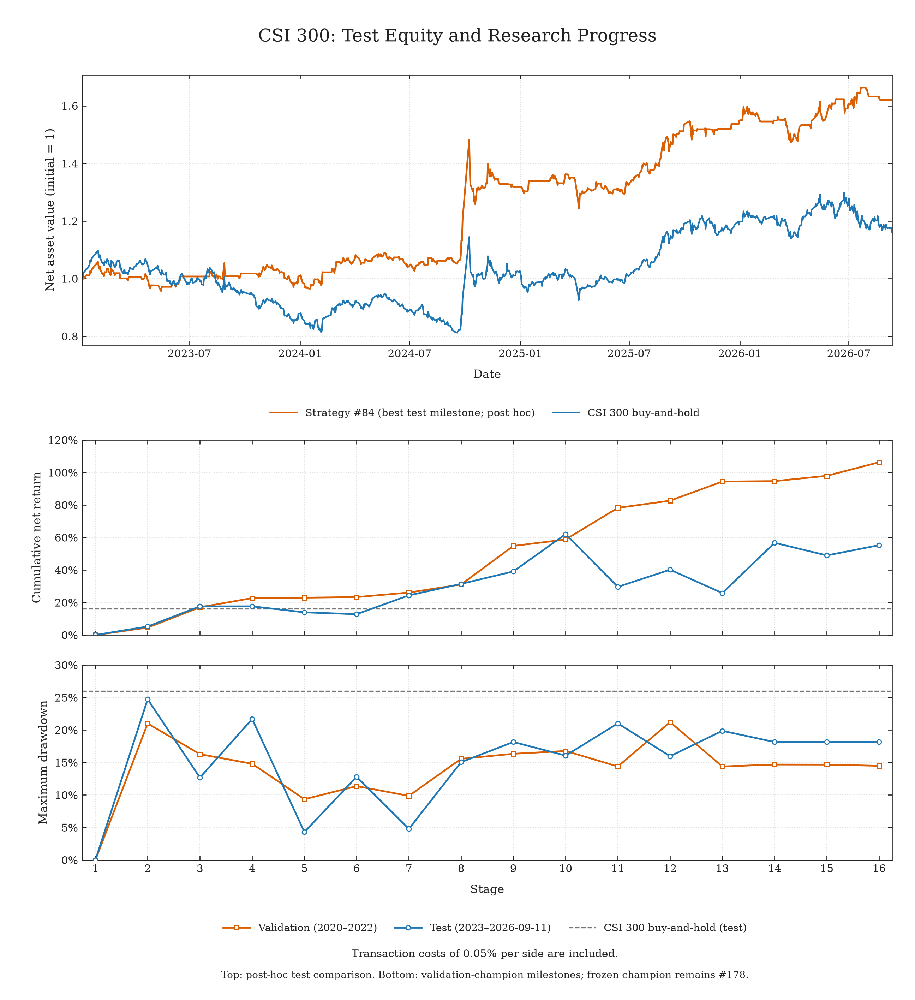
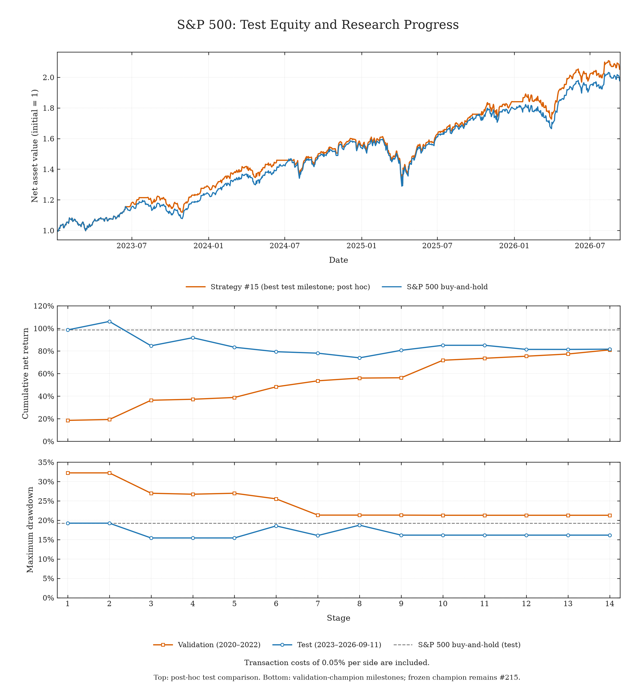

# 原始协议归档（非统一口径）

本页保留最初的价格收益结果与复现方式，不能与统一全收益结果混合比较。
[返回统一全收益报告](README.zh-CN.md)

# 完成的研究示例

[English](ARCHIVE.md)

这里记录三组采用固定协议的实验，也包括标普500未达目标的结果。这些是历史研究记录，
并不意味着自动搜索能够稳定超过满仓持有。

## 最新实验：宽基指数

20小时预算，488次尝试，18个历史验证冠军节点。
冻结策略 #478测试年化23.33%、最大回撤31.00%；事后比较方案 #162测试年化31.24%、最大回撤30.05%。

[查看最新图、评估口径与图表数据](broad_market/README.zh-CN.md)

以下为沪深300与标普500的归档结果、策略说明与复现命令。宽基实验的费用与执行口径单独说明。

## 单指数实验结果

训练集：2010—2019年。验证集：2020—2022年。测试集：2023年至2026年9月11日。
所有结果均已计入买卖各0.05%的交易成本。

| 市场 / 策略 | 选择方式 | 验证集年化收益 | 测试集年化收益 | 测试集累计收益 | 测试集最大回撤 |
|---|---|---:|---:|---:|---:|
| 沪深300 #178 | 验证集选出的冻结冠军 | 28.58% | 13.21% | 55.27% | 18.15% |
| 沪深300 #84 | 事后比较的测试收益最佳节点 | 17.40% | 14.58% | 62.07% | 16.06% |
| 沪深300满仓持有 | 基准 | −2.49% | 4.28% | 16.04% | 25.98% |
| 标普500 #215 | 验证集选出的冻结冠军 | 21.93% | 17.67% | 81.60% | 16.16% |
| 标普500 #15 | 事后比较的测试收益最佳节点 | 6.08% | 21.81% | 106.16% | 19.25% |
| 标普500满仓持有 | 基准 | 5.86% | 20.59% | 98.66% | 19.25% |

**最终冻结冠军分别为 #178 和 #215。** 下方两张合并图顶部展示的 #84 和 #15，
分别是在16个和14个历史验证冠军节点中，事后比较测试收益选出的方案。
该比较用于描述结果，没有替换最终冻结冠军。它们也不是全部尝试中测试收益最高的策略：
未成为历史冠军的尝试没有接受测试集评估。

### 沪深300



[年化收益版本](csi300/figures/combined_annual.png) · [PDF](csi300/figures/combined_returns.pdf)

### 标普500



[年化收益版本](sp500/figures/combined_annual.png) · [PDF](sp500/figures/combined_returns.pdf)

顶部子图展示测试期的每日净值。下方子图展示每次验证集改进对应的累计收益和最大回撤，
按阶段等间距排列。阶段编号不是实验次数或日期；各节点的原始尝试编号保存在
`milestones.json` 中。验证集与测试集的时间长度不同，比较收益率时可参考年化版本。

## 目标与评估协议

| 设置 | 沪深300 | 标普500 |
|---|---|---|
| Reward | 验证集累计净收益 | 验证集年化净收益 |
| 回撤约束 | 严格低于50% | 不高于50% |
| 验证集目标 | 累计收益 ≥100% | 年化收益 ≥60% |
| 尝试 / 失败次数 | 178 / 0 | 316 / 1 |
| 历史冠军节点 | 16个，含初始空仓策略 | 14个，含初始满仓持有策略 |
| 策略可用历史窗口 | 120个交易日 | 252个交易日 |
| 可用特征 | 开高低收价及原始成交量 | 开高低收价；不使用成交量特征 |
| 实际经过时间预算 | 配置上限为20小时，提前终止 | 配置上限为20小时 |

沪深300验证冠军达到累计收益目标，验证集累计收益为106.30%。
标普500验证冠军未达到60%的年化收益目标；其冻结策略在测试期收益低于满仓持有，
但回撤更小。需要注意，验证集上的持续改进不一定会稳定转化为测试集提升，因此需要观察过拟合情况。

两组实验均只做多，在指数与现金之间调整仓位，不使用杠杆，现金利息为零。
收盘后决策，下一交易日开盘执行，再按随后一个交易日的开盘价计值。
跨越数据分区边界的收益标签会被剔除；较早的价格可以用于补足历史窗口。
年化收益按每年252个交易日计算。回撤基于模拟的每日开盘净值，不代表盘中最低点回撤。
实验使用价格指数作为代理，不含股息、ETF跟踪误差、汇率和实盘执行影响。

最终冠军在冻结后接受测试。历史验证冠军随后在另行授权的审计中接受评估。
这些测试结果现已公开，复现或从中选择策略不构成新的独立测试。
完整历史行情以及模型预训练中可能包含的知识，也使这些实验无法被视为完全盲测的未来预测。

## 策略示例

下方四份源码与归档策略逐字节一致。哈希与指标保存在各市场的 `study.json` 中。
它们均实现 `fit(train)` 和 `allocate(observations, state)`，复现时会重新使用训练集拟合。

| 源码 | 方法 |
|---|---|
| [沪深300冻结冠军 #178](csi300/frozen_strategy.py) | 使用40、25、15个特征的三组随机森林，多数投票并结合RSI反转信号。 |
| [沪深300事后比较方案 #84](csi300/posthoc_strategy.py) | 单组20棵树的随机森林，结合RSI反转信号。 |
| [标普500冻结冠军 #215](sp500/frozen_strategy.py) | 等权融合月度岭回归与带特征随机失活的8单元tanh神经网络，加入波动冲击退出条件。 |
| [标普500事后比较方案 #15](sp500/posthoc_strategy.py) | 用岭回归预测日收益，以正负5个基点为进出阈值，阈值之间保持原仓位。 |

沪深300的随机森林预测经过截断处理的五日复合收益。冻结策略中，每组森林在预测值
高于0.10%时转为持仓、低于零时转为空仓，由多数投票决定森林部分的仓位。
独立的RSI(14)信号在低于30时入场，高于50或达到20个信号日时退出；
森林或RSI任一部分要求持仓时，策略即持仓。#84使用单组特征，RSI退出阈值为55。

标普500 #215使用九个由收盘价计算的特征，预测20个交易日的平均对数收益。
岭回归强度和神经网络训练检查点通过训练集末段按时间顺序选择，并剔除边界处21行样本。
神经网络训练时采用10%的输入随机失活。平均预测值控制满仓或空仓，
再结合五日相对六十日的波动冲击，以及跌破此前三个收盘价低点的条件过滤信号。
#15则使用13个价格及OHLC特征进行日收益岭回归预测，在预测值处于
−0.05%至+0.05%之间时保持原仓位。

## 复现公开指标

在仓库根目录执行，要求Python 3.10+，仅依赖标准库：

```sh
python3 -B examples/studies/replay.py --market csi300
python3 -B examples/studies/replay.py --market sp500
```

只复现某一种策略时，例如冻结冠军：

```sh
python3 -B examples/studies/replay.py --market sp500 --strategy frozen
```

脚本会检查内置数据与策略的哈希，重建原始历史窗口和时间边界，仅用训练集拟合，
并将每项验证集、测试集指标与归档值进行核对。各分区均从新的状态开始。
脚本不创建研究工作区或测试标记，也不写入结果；它用于复现已公开的实验，
不是让Agent访问新实验最终测试集的入口。

这些实验使用包含OHLC历史的数据接口。主框架的最简适配器目前仅提供收盘历史，
因此归档策略**不能直接替换默认策略**。独立复现入口保留了原始实验行为，
同时保持主框架简洁。开展新实验时，不要向研究Agent开放本目录或完整内置行情。

## 文件说明

每个市场目录包含：

- `frozen_strategy.py`、`posthoc_strategy.py`：公开的两份策略快照。
- `study.json`：原始配置、预算说明、数据哈希和所选策略指标。
- `milestones.json`：所有已评估的历史冠军与满仓持有基准。
- `attempts.csv`：全部尝试的描述、哈希、状态和验证集指标。
- `daily_equity.csv`：图中事后比较方案与基准的每日净值。
- `figures/`：首页使用的独立测试期净值图，以及累计收益、年化收益两版合并图，均包含PNG、SVG和PDF格式。

`plot.py` 根据公开记录重新绘图，不拟合策略，也不读取原始价格历史。
仅绘图需要Matplotlib：

```sh
python3 -m pip install matplotlib
python3 examples/studies/plot.py --market csi300 --output /tmp/csi300-figures
python3 examples/studies/plot.py --market sp500 --output /tmp/sp500-figures
```

在任一绘图命令后添加 `--equity-only`，即可重新生成仓库首页使用的独立净值图。

本示例包未包含完整Agent对话、每份被丢弃的策略源码及私有工作区。
日志与快照支持复现已公开的策略和图表，不保证未来Agent搜索过程完全相同。
