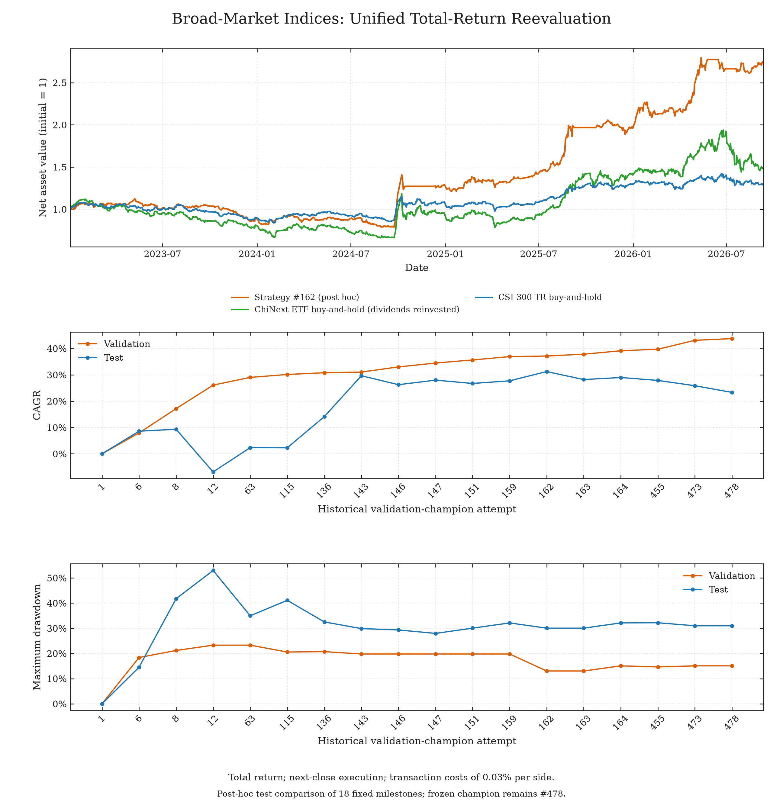
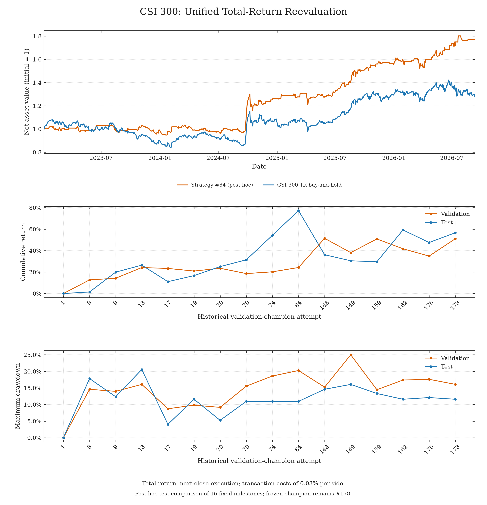
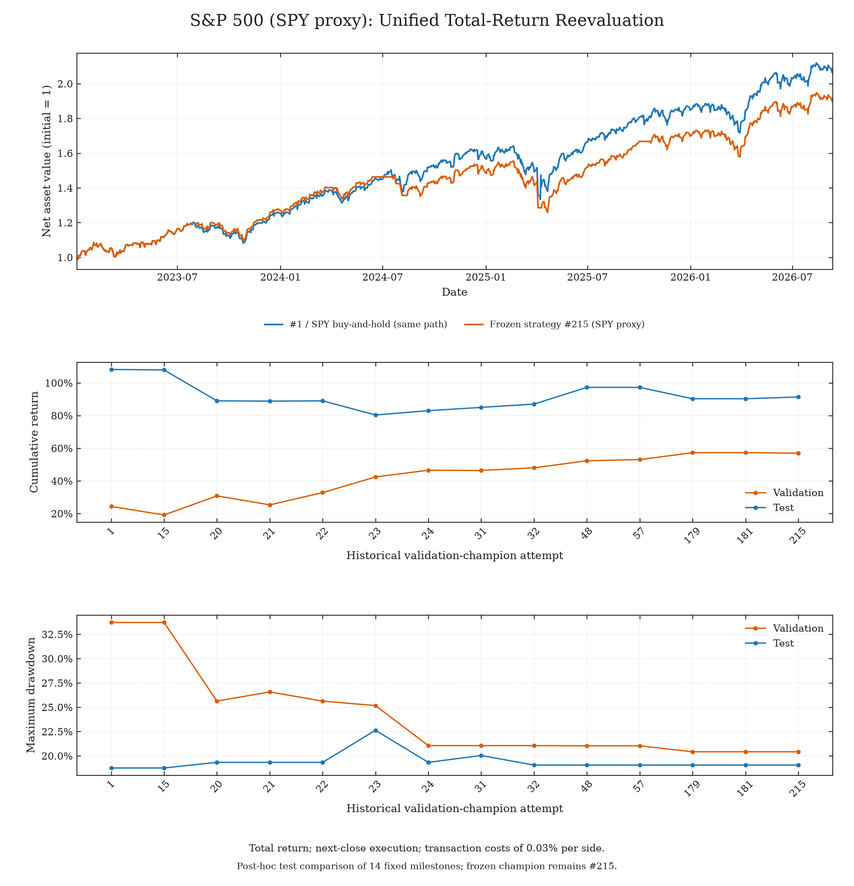

# 研究结果 · 统一全收益口径

[English](README.md)

下方宽基、沪深300和标普500实验统一使用同一个收益评估器：分红再投资、收盘后产生信号、
下一交易日收盘成交、买卖各0.03%费用、按实际日历天数年化，各分区净值均从1开始。
这是**固定历史策略的统一口径复评**，没有重新搜索策略；原训练输入、信号特征和冻结冠军编号保持不变。

## 结果

| 市场 / 方案 | 选择方式 | 验证年化 | 测试累计收益 | 测试年化 | 测试最大回撤 |
|---|---|---:|---:|---:|---:|
| 宽基 #478 | 冻结冠军 | 43.75% | 116.70% | 23.33% | 31.00% |
| 宽基 #162 | 事后测试最佳节点 | 37.14% | 172.52% | 31.24% | 30.05% |
| 沪深300 #178 | 冻结冠军 | 14.76% | 56.61% | 12.93% | 11.59% |
| 沪深300 #84 | 事后测试最佳节点 | 7.52% | 77.30% | 16.80% | 10.96% |
| 沪深300全收益 | 买入持有 | -0.25% | 28.13% | 6.95% | 22.41% |
| 标普500（SPY代理） #215 | 冻结冠军 | 16.26% | 91.39% | 19.25% | 19.05% |
| 标普500（SPY代理） #1 | 事后测试最佳节点 | 7.57% | 108.22% | 22.00% | 18.76% |
| SPY含分红 | 买入持有 | 7.57% | 108.22% | 22.00% | 18.76% |

宽基候选池包含 **24个指数及ETF代理**。冻结冠军仍为 #478，事后比较方案仍为 #162。
两组国内实验共用完全相同的沪深300基准：累计收益 **28.13%**、年化 **6.95%**、
最大回撤 **22.41%**。创业板ETF买入持有累计收益 **47.32%**、年化 **11.08%**、最大回撤 **40.88%**。

沪深300冻结冠军仍为 #178；在原有16个历史节点中，#84的测试收益最高。
新口径下 #178验证集累计收益为 **50.99%**，未达到原先100%的目标。
此前106.30%的验证收益属于原执行协议，不能沿用到此次复评。

标普实验的策略与基准均采用 **SPY含分红复权收盘价作为全收益代理**，并非标普500官方全收益指数；
基金费用与跟踪差异已经包含在行情中。已检查的数据源暂未能下载完整的指数全收益日线，
因此采用已固定版本的公开SPY数据，覆盖全部1,682个评测交易日，不使用基金成立前的合成数据。
冻结策略 #215收益低于买入持有，测试回撤也略高。14个固定节点中收益最高的变为初始买入持有 #1；
原事后比较方案 #15累计收益为 **107.91%**。#1与基准的每日净值完全相同，因此标普图中同时展示
冻结策略 #215，便于观察差异。

需要注意，验证集上的持续改进不一定会稳定转化为测试集提升，因此需要观察过拟合情况。
测试集最佳节点属于事后比较，没有替换冻结冠军，也不构成新的独立盲测成功。
未成为历史冠军的尝试没有接受测试集评估。

## 图表

### 宽基指数 · 20小时预算



[净值图](total_return/broad_market/figures/test_equity.png) · [PDF](total_return/broad_market/figures/combined_annual.pdf) · [实验说明](broad_market/README.zh-CN.md)

### 沪深300



[年化版本](total_return/csi300/figures/combined_annual.png) · [PDF](total_return/csi300/figures/combined_returns.pdf)

### 标普500 · SPY全收益代理



[年化版本](total_return/sp500/figures/combined_annual.png) · [PDF](total_return/sp500/figures/combined_returns.pdf)

下方子图按原历史验证冠军的顺序重新计算指标，不是在新口径下重新挑选的冠军序列。
横轴显示原尝试编号，各节点等间距排列，不代表等长研究时间。

## 目标与评估协议

| 设置 | 沪深300 | 标普500 | 宽基 |
|---|---|---|---|
| Reward | 验证集累计净收益 | 验证集年化净收益 | 验证集年化净收益 |
| 回撤约束 | <50% | ≤50% | `min(50%, 26.34% + (CAGR − 20%) / 2)` |
| 验证集目标 | 累计收益 ≥100% | 年化收益 ≥60% | 年化收益 ≥30% |
| 尝试 / 失败次数 | 178 / 0 | 316 / 1 | 488 / 4 |
| 历史节点 | 16 | 14 | 18 |
| 实际经过时间预算 | 配置上限为20小时，提前终止 | 配置上限为20小时 | 配置上限为20小时 |

训练集仍为2010—2019年，验证集2020—2022年，测试集2023年至2026年9月11日。
按各自交易所日历：国内验证/测试分别728/896个交易日，美国为756/926个交易日。
两地测试均从1月3日收盘开始，买入持有基准于1月4日收盘买入。
所有组合只做多、无杠杆，现金利息为零，期末不强制平仓；买入持有仅买入一次，之后保持份额。
按实际成交金额扣费，净值起点为1不会消除建仓费用。回撤基于每日收盘净值；
年化按实际经过天数除以365.2425计算。全收益指数和含分红复权ETF行情已包含分红，不能重复添加。

此次只统一收益与记账：单指数策略仍使用原价格指数训练标签拟合，从原OHLC历史生成决策；
宽基按冻结归档订单重放。没有根据测试结果调参、用未来价格生成信号或修改冻结实验。
成交时点、费用、估值、年化和SPY代理均与部分旧报告不同，结果变化不能全部归因于分红。

## 策略与复现

归档源码：[沪深300 #178](csi300/frozen_strategy.py)、[沪深300 #84](csi300/posthoc_strategy.py)、
[标普500 #215](sp500/frozen_strategy.py)、[原标普事后方案 #15](sp500/posthoc_strategy.py)。
[原策略说明](ARCHIVE.zh-CN.md#策略示例)保留算法细节；该归档页的旧指标采用原口径。

在仓库根目录执行，Python 3.10+，只依赖标准库：

```sh
python3 examples/studies/total_return/evaluate.py --market csi300
python3 examples/studies/total_return/evaluate.py --market broad_market
python3 examples/studies/total_return/evaluate.py --market sp500
python3 -m unittest discover -s examples/studies/total_return -p 'test_*.py'
python3 examples/studies/total_return/report.py
```

如需从不变的策略源码和原训练数据重建决策，运行同目录下的
`extract_signals.py --market csi300`，或将市场替换为 `sp500`。
`fetch_spy.py` 可重新下载固定版本的代理数据并检查哈希。
`plot.py --market MARKET` 用于重新绘图，仅此步骤依赖Matplotlib。
评估器先检查输入哈希，再复核宽基全部29,232条日净值；回归检查要求两组沪深300基准逐日一致。

[数据来源与哈希](total_return/manifest.json) · [国内收益行情](total_return/data/china_total_return.csv) · [SPY收益行情](total_return/data/spy_total_return.csv)

`total_return/` 的每个市场目录包含 `results.json`、`stages.csv`、`equity.csv`、`figures/`，
以及固定信号或订单。原价格口径日志、快照与复现命令保留在[原协议归档](ARCHIVE.zh-CN.md)。
最简新实验运行器本轮未改动，仍使用原价格指数适配器；复现本页全收益结果请使用上面的明确入口。
开展新实验时，不要向研究Agent开放这些已公开的测试数据与研究者报告目录。
