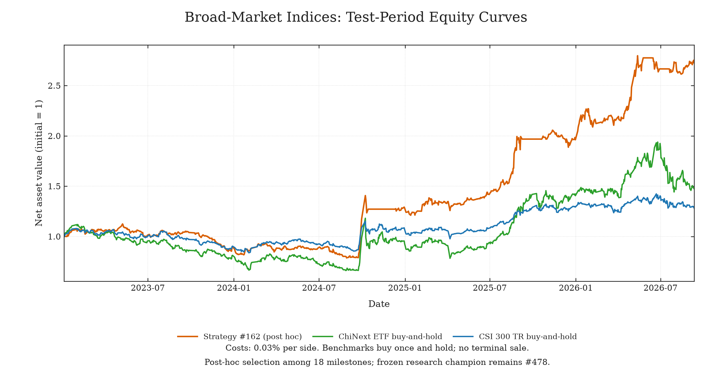

# Broad-market index study

[中文](README.zh-CN.md) · [All studies](../README.md)

A 20-hour research budget produced 488 attempts: 484 completed backtests,
4 failures and 18 historical validation champions. The Agent researches asset
selection and portfolio allocation across 24 indices and ETF proxies. This release includes only
the latest figure and its supporting data.



[Equity chart PDF](figures/test_equity.pdf) · [Research progress composite](figures/combined_annual_return.png) · [Composite PDF](figures/combined_annual_return.pdf)

## Results

| Strategy | Selection | Validation CAGR | Test total return | Test CAGR | Test max drawdown |
|---|---|---:|---:|---:|---:|
| #478 | Frozen validation champion | 43.75% | 116.70% | 23.33% | 31.00% |
| #162 | Highest test-return milestone, post hoc | 37.14% | 172.52% | 31.24% | 30.05% |

The equity chart compares #162 with ChiNext and CSI 300 buy-and-hold, all starting
from 1. The research progress composite uses the same equity comparison; its lower
panels show validation/test CAGR and maximum drawdown across 18 milestones.
Stages indicate milestone order, not equal numbers of attempts or elapsed research time.

| Test-period approach | Total return | CAGR | Max drawdown |
|---|---:|---:|---:|
| #162 (post hoc) | 172.52% | 31.24% | 30.05% |
| ChiNext buy-and-hold | 47.32% | 11.08% | 40.88% |
| CSI 300 buy-and-hold | 28.13% | 6.95% | 22.41% |

ChiNext uses backward-adjusted ETF 159915 prices; CSI 300 uses the H00300 total-return
index. Both series come from this study's data. The benchmarks signal at the close
on January 3, 2023 and buy at the January 4 close, paying a 0.03% purchase fee.
They retain the same units thereafter, without a terminal sale. Fees remain in the
equity paths; no normalization after entry removes them. The CSI 300 total-return
series differs from the price index in the single-index example, so its buy-and-hold
return also differs.

#162 was selected retrospectively from 18 evaluated validation champions; not all
488 attempts were tested. It did not replace frozen strategy #478, whose test CAGR
fell below the 30% target and whose drawdown exceeded its corresponding limit of
about 28.00%. #162 met the numerical thresholds in this retrospective comparison;
that does not constitute a new independent blind-test success.

Note that continued improvements on the validation set may not consistently
translate into better test performance, so monitor for overfitting.

## Evaluation conventions

| Setting | Detail |
|---|---|
| Wall-clock budget | Configured 20-hour cap |
| Training | 2010–2019 |
| Validation | 2020–2022 |
| Test trading dates | January 3, 2023–September 11, 2026; 896 sessions |
| Reward | Maximize net CAGR among feasible candidates |
| CAGR target | ≥30% |
| Drawdown limit | `min(50%, 26.34% + (CAGR − 20%) / 2)` |
| Transaction costs | 0.03% per side, charged on executed amounts |
| Execution | Signal at close; execute at the next session's close |
| Annualization | Actual calendar days / 365.2425 |
| Positions | Long-only, no leverage, zero cash interest, no forced terminal liquidation |

Each partition starts with cash equity of 1. Execution timing, costs and annualization
differ from the single-index CSI 300 study; read each result with its own protocol.
This historical test period had already appeared in prior research and the results
are now public. Further validation requires new data that did not inform selection.

## Chart data

- [figures/test_equity.csv](figures/test_equity.csv): all three daily equity paths shown in the chart.
- [figures/comparison_metrics.json](figures/comparison_metrics.json): total return, CAGR and maximum drawdown for the three approaches.
- [benchmark_closes.csv](benchmark_closes.csv), [benchmark_sources.json](benchmark_sources.json): benchmark prices, provenance, hashes and calculation conventions.
- [best_methods_test_curves.csv](best_methods_test_curves.csv): original #162 and #478 archives; #478 is no longer plotted.
- [stage_metrics.csv](stage_metrics.csv): metrics and constraint checks for all 18 historical validation champions.
- [presentation_selection.json](presentation_selection.json): plotted strategy roles and selection method.

The strategy path comes from the completed archive. Only the two buy-once benchmarks
were calculated; no new strategy search or strategy final-test replay was performed.
Recalculate benchmarks and redraw the figures (requires Matplotlib):

```sh
python3 examples/studies/broad_market/plot.py --output /tmp/broad-market-figures
```

This directory publishes charts and
summary data only; the parent directory's `replay.py` still supports only CSI 300
and S&P 500, not this broad-market study.
